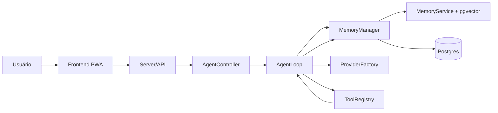

# Arquitetura do AndClaw

**Versão:** 3.0  
**Status:** Arquitetura Atualizada  
**Autor:** AndClaw Agent  
**Data:** 2026-04-06

---

## 1. Visão Geral

O AndClaw é um agente pessoal composto por:

- **Frontend PWA** para operação diária
- **Backend Node.js** para autenticação, rotas e integrações
- **AgentLoop** como motor ReAct
- **MemoryManager + pgvector** como camada de memória persistente
- **ToolRegistry** como catálogo de capacidades executáveis

O sistema passou a operar como **monólito modular**, com separação lógica entre frontend, core, memória, providers, server, DB e integrações.

---

## 2. Princípios Arquiteturais

1. **Memória é core**
   - histórico conversacional
   - memória semântica
   - recuperação por similaridade

2. **Provider é substituível**
   - embeddings e LLMs são independentes

3. **Tools são módulos**
   - cada ferramenta deve ter contrato explícito

4. **Server deve ser fino**
   - auth, rotas e integrações não devem ficar misturados

---

## 3. Camadas

### 3.1 Core

- `AgentLoop`
- `AgentController`
- `ToolRegistry`
- `EmbeddingService`
- `MemoryService`

### 3.2 Memory

- `MemoryManager`
- repositórios de conversa e mensagens

### 3.3 Providers

- `GeminiProvider`
- `DeepSeekProvider`
- `OpenRouterProvider`
- `LocalOllamaProvider`
- `ProviderFactory`

### 3.4 Server

- `auth`
- `routes`
- `llm`
- `settings`
- `admin`

### 3.5 Infra

- `db/postgres`
- `db/schema`
- `infra/db/vector`

---

## 4. Fluxo Principal

---

## 5. Decisões de Tecnologia

| Componente | Tecnologia |
|------------|------------|
| Runtime | Node.js + TypeScript |
| Persistência | Postgres |
| Busca semântica | pgvector |
| LLM | múltiplos providers |
| Frontend | PWA React/Vite |

---

## 6. Regras de Evolução

- não quebrar `AgentLoop`
- não remover providers existentes
- não concentrar novas responsabilidades em `routes.ts`
- novas capacidades devem entrar primeiro como módulo/service e só depois como interface

---

## 7. Próximos Passos Estruturais

1. separar server em submódulos reais
2. migrar `ToolRegistry` para ferramentas moduladas
3. reforçar contratos da API do frontend
4. revisar specs sempre que o código mudar
